# LoRa Workshop

## Introduction

**LoRa**™ is a radio technology developed for long range, low power and high-density Internet of Things (IoT) deployments typically laid in a star-of-stars topology. In this workshop we are going to build a LoRaWAN sensor node using the Microchip RN2483 LoRa modem, the Teensy LC as a host MCU and [The Things Network](https://www.thethingsnetwork.org/) public LoRaWAN network. Furthermore, we will use Node-RED to pass on the sensor data from The Things Network to the [relayr Dashboard](https://dev.relayr.io/) where the data will be stored, visualized and exposed through our [REST API](https://docs.relayr.io/api/). 

## Requirements

The following hardware is required:

* [Teensy-LC microcontroller board]((https://www.pjrc.com/teensy/teensyLC.html))
* [RN2483 module](http://www.microchip.com/wwwproducts/en/RN2483) + breakout board
* [GP2Y0A21YK distance measuring sensor](http://www.sharpsma.com/webfm_send/1208)
* [Magnetic switch](https://www.sparkfun.com/products/13247)
* Mini breadboard (400 tie in points)
* Assorted jumper wires

Besides, the following software packages and services are required:

* [Arduino IDE](https://www.arduino.cc/en/main/software)
* [Teensyduino Arduino add-on](https://www.pjrc.com/teensy/td_download.html)
* [The Things Network account](https://www.thethingsnetwork.org/)
* [Node-RED](https://nodered.org/docs/getting-started/installation)
* [relayr account](https://developer.relayr.io/)

## Repository Structure

This git repository contains the following three code snippets, placed in folders with the corresponding names:

* `usb-to-serial.ino`: Arduino sketch which enables you to interact with the RN2483 LoRa module by using the serial terminal on your computer.
* `sensor-node.ino`: Arduino sketch which repetedly reads the sensor values and sends them over the pre-configured RN2483 LoRa module to your account on *The Things Network*.
* `node-red` snippet (named `ttn_to_relayr_v1.json`): A Node-RED flow that subscribes to *The Things Network* MQTT stream and forwards it to the *relayr Developer Dashboard*.

## Installation & Configuration

### Setting Up the Hardware

The [Teensy-LC](https://www.pjrc.com/teensy/teensyLC.html) is a 32-bit microcontroller board that features an ARM Cortex-M0+ processor at 48 MHz, 62K Flash, 8K RAM, 12 bit analog input & output, hardware Serial, SPI & I2C, USB, and a total of 27 I/O pins.

In this setup, it will be used in combination with the RN2483, a fully-certified 433/868 MHz module based on wireless LoRa® technology. This module counts with a UART interface, so the Teensy-LC can easily control it through its [command / response interface](http://ww1.microchip.com/downloads/en/DeviceDoc/40001784B.pdf)

The RN2483 must be connected to the Teensy-LC board as follows. For your convenience, you may check the [pinout graphic](https://www.pjrc.com/teensy/teensylc_front_pinout.png) of the board.

```
    RN2483   |   TEENSY-LC
       Gnd ----- G
       3V3 ----- 2
        Rx ----- 1
        Tx ----- 0
``` 

### Setting Up the Software

First of all, install the last version of the [Arduino IDE](https://www.arduino.cc/en/main/software) for your operating system. The Arduino IDE is an open-source minimalistic integrated development environment to compile Arduino programs, known as *sketches* (files with the `.ino` extension). Besides, it enables the users to upload the compiled sketches to different devices, as well as to interface with them via the Serial Monitor.

To be able to compile programs for the Teensy-LC, to upload them to the board, and to communicate with it via USB, we will need to install the [Teensyduino Arduino add-on](https://www.pjrc.com/teensy/td_download.html). Simply select your operating system, and follow the instructions on-screen.

Once ready, we can start interfacing with our prototype in the following section. 

**Note:** As mentioned in the requirements, an installation of Node-RED as well as accounts on The Things Network and on the relayr platform are required. These actions can, however, be performed later.

## Interfacing with the RN2483 Module Using the Teensy-LC 

1. On the Arduino IDE, click on `File` → `Open`, and look for the Arduino sketch `usb-to-serial.ino` that can be found in the folder with the same name.

2. Now click on `Tools` → `Board`, and select `Teensy LC`, as shown below.

  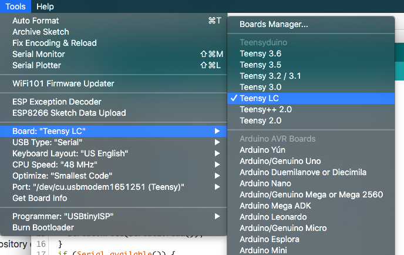

3. Your Teensy LC board should be connected to your computer via USB. Select the right port clicking on `Tools` → `Port`. An example of this step in OSX is depicted for clarity.

  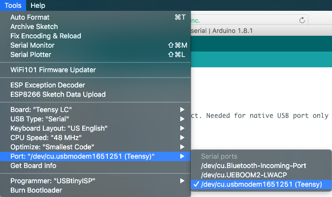

4. Open the Serial Monitor in the Arduino IDE. Simply click on the small icon of a magnifying glass in the top right corner.

  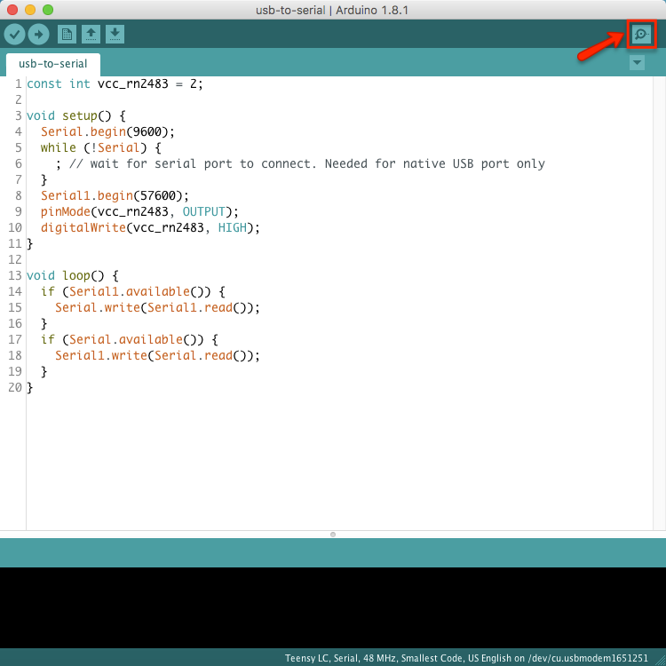

5. The Serial Monitor window will open, displaying a message from the RN2483 module. The Teensy LC is now acting as an interface between our computer and such module.

  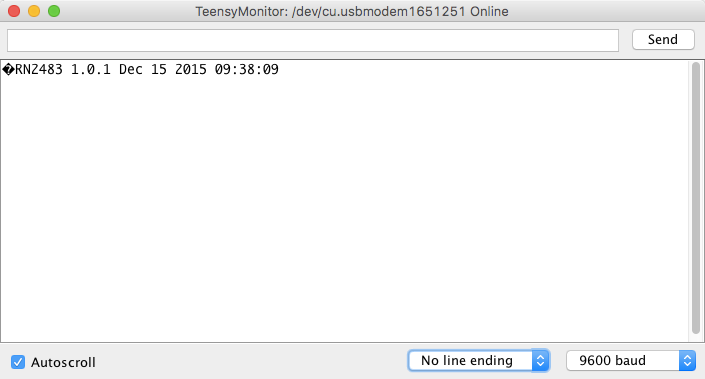

6. Instead of `No line ending`, select `Both NL & CR` as the new line character.

  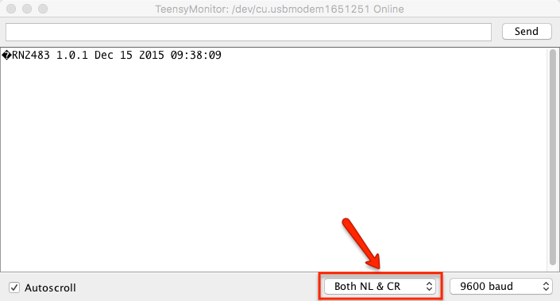

Now we are ready to interact with the RN2483 module through its [command / response interface](http://ww1.microchip.com/downloads/en/DeviceDoc/40001784B.pdf), so we can proceed to the next part where we will retrieve our LoRaWAN keys to configure it.

## Retrieving LoRaWAN Keys

On the next step we will retrieve the LoRaWAN keys from The Things Network.

1. Head to [The Things Network](https://account.thethingsnetwork.org/users/login) and click on `Create an Account`, on the bottom of the white frame. If you already have an account, you can skip this step, and  log in already.

  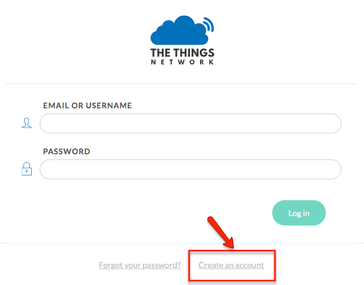

2. Once you are logged in, go to `Console` and make sure you are in the `Applications` submenu (or simply click [here](https://console.thethingsnetwork.org/applications)).

3. Now click on `Add application`, and fill the fields `Application ID` and `Description`. Click on the `Add application` button to continue.

  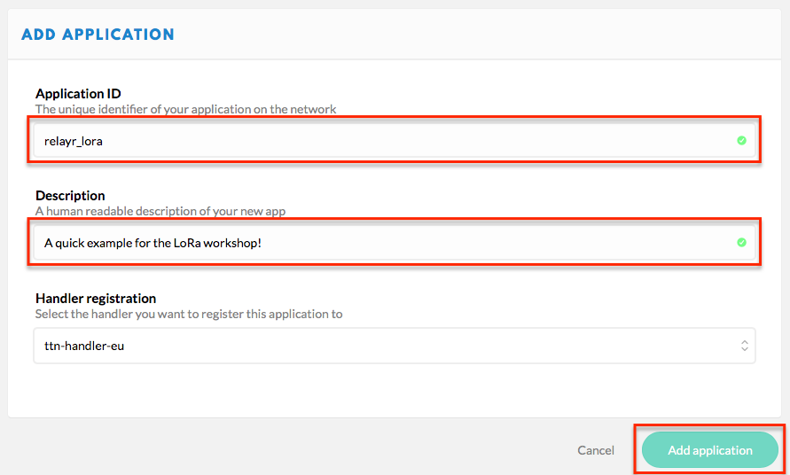
  
4. On the following menu, head to `Devices` and click on `register device`. In this section, you will be prompted to provide a `Device ID` (which **cannot** be changed later) and a `Device EUI` consising on 8 bytes in hexadecimal notation (which can be changed later if needed). Click on `Register` to continue.

  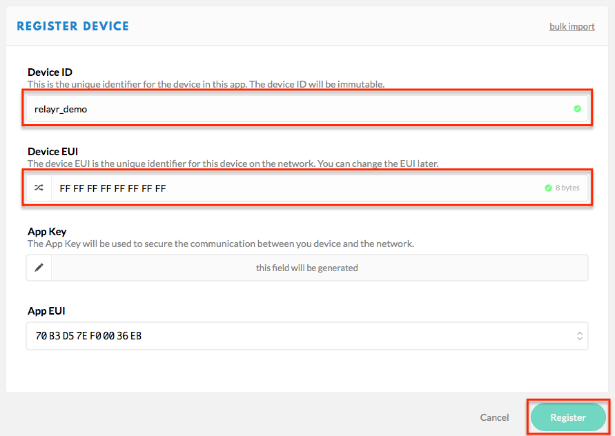

5. The next window will show the `Device Overview`. In this menu we can already retrieve our LoRaWAN keys, but it depends on the activation method we want to use. As you can see on the image below, **the default activation method is *OTAA (Over The Air Activation)***. The keys for these method are also shown here.

  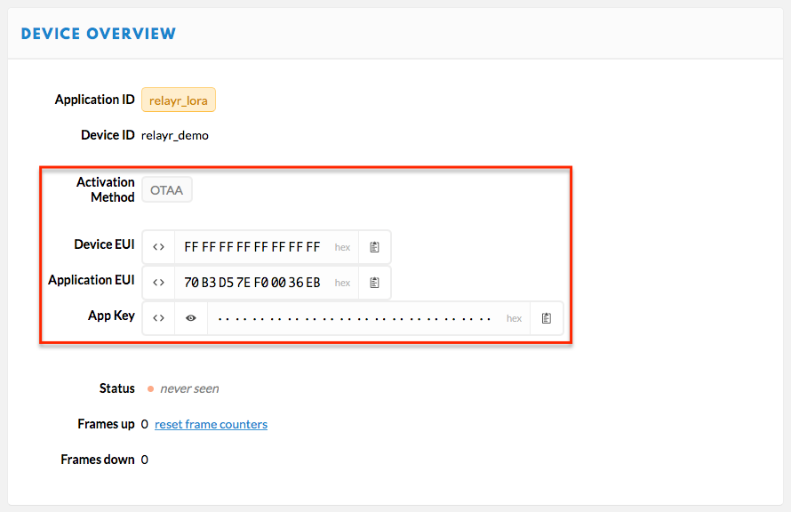

6. On the next part, two activation methods will be explained. As said, **the LoRaWAN keys for each method are different**. Thus, to retrieve the right keys, we will have to change the activation method depending on our choice. This can be easily done clicking on `Settings` (on the top right corner), and then selecting OTAA or ABP as `Activation Method`. The following example shows *ABP (Activation By Personalization)* as the preferred method.

  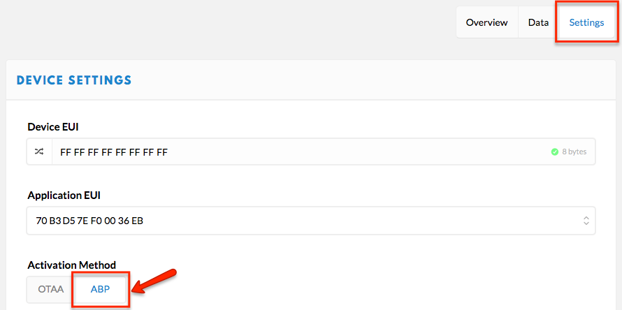

## Configuring the RN2483 Module with the LoRaWAN Keys

On this part we will be setting the necessary LoRaWAN keys and saving them to the module's read-only memory (EEPROM). With these keys our device can be activated (and thus, recognized by the gateway). As said, there are two ways of performing this activation. Both methods are covered below, each with a different set of commands.

**These commands must be sent one by one using the Serial Monitor of the Arduino IDE.** To send a command, first introduce it, and press Enter or click `Send`. An example with the first command of the *Activation By Personalization* is shown below.

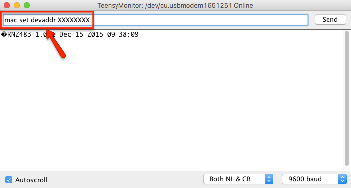

### Activation By Personalization (ABP)

On this part we will be setting the necessary LoRaWAN keys and saving them to the module's EEPROM. The three first commands set the `Device Address`, `Network Session Key` and `Application Session Key`, while the command `mac save` makes sure that these keys are stored in the EEPROM. For the *Activation By Personalization (ABP)* use the following commands:

```
mac set devaddr <Device Address>
mac set nwkskey <Network Session Key>
mac set appskey <Application Session Key>
mac save
```

As explained on the previous section, these keys can be generated and retrieved on your The Things Network account. Head to the `Devices` menu, select your device, and click on `Device Overview`. **On `Activation Method` it should mention ABP**. Otherwise, click on `Settings` (on the top right corner), and then select ABP as `Activation Method`, as shown in this example: 


Scroll down and click on `Save`.

Now, on the `Device Overview` window we can see the `Device Address`, `Network Session Key` and `Application Session Key` (or App Session Key):

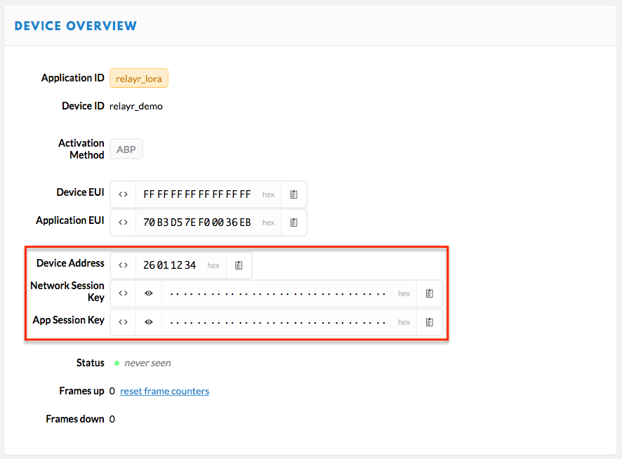

We're ready to send them to the module via the Serial Monitor of the Arduino IDE, using the commands mentioned before.

**Example:** The first command sends the `Device Address` which in our case is 26 01 12 34. Thus, the right command will be `mac set devaddr 26011234`.

**Tip:** For security reasons, on this menu the `Network Session Key` and the `Application Session Key` are masked by default. To see them, simply click on the small icon with an eye. To copy them, click on the small icon with a notepad.

### Over The Air Activation (OTAA)

Alternatively we could also use *Over The Air Activation (OTAA)* use the following commands:

```
mac set appeui <Application EUI>
mac set appkey <App Key>
mac save
mac join otaa
```

These keys can be generated and retrieved on your The Things Network account. Head to the `Devices` menu, select your device, and click on `Device Overview`. **On `Activation Method` it should mention OTAA**. Otherwise, click on `Settings` (on the top right corner), and then select OTAA as `Activation Method`.

Now, on `Device Overview` we can see our `Application EUI` and `Application Key` (or App Key), as depicted below:


We're ready to send them to the module via the Serial Monitor of the Arduino IDE, using the commands mentioned before.

**Example:** The first command sends the `Application EUI` which in our case is 70 B3 D5 7E F0 00 36 EB. Thus, the right command will be `mac set appeui 70B3D57EF00036EB`.

**Tip:** For security reasons, on this menu the `Application Key` (or App Key) is masked by default. To see it, simply click on the small icon with an eye. To copy it, click on the small icon with a notepad.

### Testing the Network

If you wish to send some data to the network server you must first execute a command for joining the network:

```
mac join <mode>
<mode>: abp (activation by personalization),
        otaa (over the air activation)

e.g. mac join abp
```

After your request was accepted you can send a payload over LoRaWAN:

```
mac tx <type> <portno> <data>
<type>: cnf (confirmable)
        uncnf (unconfirmable)
<portno>: number between 1 and 223
<data>: hex payload

e.g. mac tx uncnf 4 3A1B
```

You should see the data appear in your `Application Data` on The Things Network.

## Adding Sensors to the Prototype

Before joining the network and start sending data over LoRaWAN, we will add the following sensors to the protoype: A simple magnetic switch and a distance measuring sensor.

### Connecting the Magnetic Switch

A [magnetic switch](https://en.wikipedia.org/wiki/Reed_switch) is a small reed switch that can detect if a door, window or any other aperture is open.

It should be connected to the Teensy-LC board as follows. Note that, since it's a switch, the wires of this sensor are exchangeable. This means that one of it's wires has to be connected to 3V, and the other to pin 15, but the allocation is irrelevant. For your convenience, you may check the [pinout graphic](https://www.pjrc.com/teensy/teensylc_front_pinout.png) of the board.

```
    SWITCH   |   TEENSY-LC
      Wire ----- 3V
      Wire ----- 15
``` 

### Connecting the Distance Measuring Sensor

The [GP2Y0A21YK](http://www.sharpsma.com/webfm_send/1208) is a wide-angle infrared distance measuring sensor from Sharp.

It should be connected to the Teensy-LC board as follows. For your convenience, you may check the [pinout graphic](https://www.pjrc.com/teensy/teensylc_front_pinout.png) of the board.

```
    SENSOR   |   TEENSY-LC
       Red ----- 3V
     Black ----- G
    Yellow ----- 14/A0
``` 

## Sending Sensor Data over LoRaWAN

Once we sent all commands for our preferred activation method (either ABP or OTAA), and we completed the setup adding two sensors, we are ready to test our prototype.

On the Arduino IDE, click on `File` → `Open`, and look for the Arduino sketch `sensor-node.ino` that can be found in the folder with the same name.

This sketch joins the LoRaWAN network using the provided keys and sends data from the two sensors that we've just added.

## The Things Network to the relayr Platform

Now you can use `node-red` to subscribe to data recived by the things network and forward it to your account on relayr to store, visulize the data and expose it through our [REST API](https://docs.relayr.io/api/).

Create a new device on *relayr Dashboard* by using the `LoRa Workshop` device model. Follow the [official relayr documentation](https://docs.relayr.io/cloud/getting-started/adding-your-first-device/) if you need help with that.

After that install `node.js` and `node-red` by following the offical Node-RED [getting started guide](https://nodered.org/docs/getting-started/). Once installed copy the `ttn_to_relay_v1.json` content to your clipboard and use it Node-RED by pasting it in `Import` → `Clipboard` and then clicking on `Import` button.


The next thing you need to do is add your credentials to `The Things Network` MQTT node. Double click on it, press the edit icon of the `Server` settings. Under the `Security` tab add your `Application ID` from the *The Things Network* account overview as your `Username` and `default key` as your `Password`.

The other Node-RED node you need to set up is the MQTT output named `relayr Cloud`. You will need to modify the `Topic` (<device id>) and add the `Username` and `Password` in *Security* tab just as in `The Things Network` node. You can find these in `Device Settings` of your newly created device on the relayr Dashboard.

After setting up everything you can click `Deploy` in node red and see the data appear on the *relayr Dashboard*.

## References

### RN2483

[Command Reference](http://ww1.microchip.com/downloads/en/DeviceDoc/40001784B.pdf)

### TTN

[Create an account](https://account.thethingsnetwork.org/register)

### Node-red

[Getting Started Guide](https://nodered.org/docs/getting-started/)

[TTN nodes](https://www.npmjs.com/package/node-red-contrib-ttn)

### relayr

[Developer Dashboard](https://developer.relayr.io/)

## To Do

* Modify the tutorial flow to include the Marvin documentation.

## License

Copyright (C) 2017 relayr GmbH, Klemen Lilija <klemen@relayr.io>, Jaime González-Arintero Berciano <jaime@relayr.io>

Permission is hereby granted, free of charge, to any person obtaining a copy of this software and associated documentation files (the "Software"), to deal in the Software without restriction, including without limitation the rights to use, copy, modify, merge, publish, distribute, sublicense, and/or sell copies of the Software, and to permit persons to whom the Software is furnished to do so, subject to the following conditions:

The above copyright notice and this permission notice shall be included in all copies or substantial portions of the Software.

Except as contained in this notice, the name(s) of the above copyright holders shall not be used in advertising or otherwise to promote the sale, use or other dealings in this Software without prior written authorization.

THE SOFTWARE IS PROVIDED "AS IS," WITHOUT WARRANTY OF ANY KIND, EXPRESS OR IMPLIED, INCLUDING BUT NOT LIMITED TO THE WARRANTIES OF MERCHANTABILITY, FITNESS FOR A PARTICULAR PURPOSE AND NONINFRINGEMENT.  IN NO EVENT SHALL THE AUTHORS OR COPYRIGHT HOLDERS BE LIABLE FOR ANY CLAIM, DAMAGES OR OTHER LIABILITY, WHETHER IN AN ACTION OF CONTRACT, TORT OR OTHERWISE, ARISING FROM, OUT OF OR IN CONNECTION WITH THE SOFTWARE OR THE USE OR OTHER DEALINGS IN THE SOFTWARE.